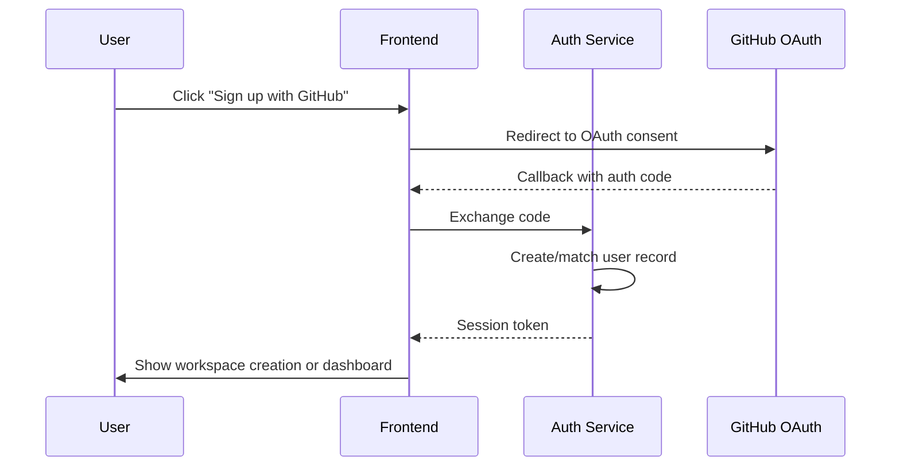
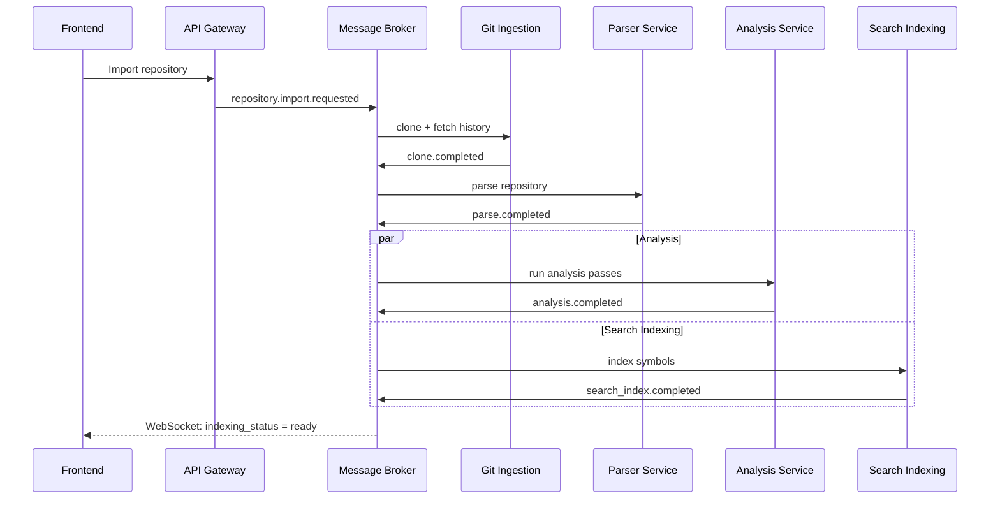
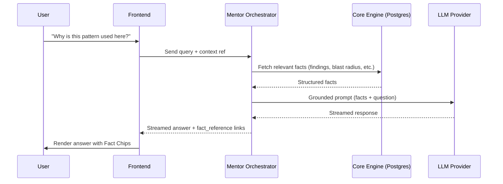

# CodeLore — Complete Application Flow

---

## 1. User Signup

**Screens**: Landing Page → Sign Up → (GitHub OAuth) → Workspace Creation/Join → Repository Dashboard (empty state)

**Flow**:
1. User lands on the marketing page and clicks "Import a repository" or "Sign up."
2. User chooses **GitHub OAuth** (primary path, since it also enables private repo import in the same step) or email/password.
3. If new to CodeLore: prompted to create a workspace (name) or accept a pending invite if their email matches one.
4. If joining an existing workspace via invite: skip workspace creation, land directly in that workspace's Repository Dashboard.
5. First-time users see the empty Repository Dashboard with a single prominent "Import your first repository" action.

**Edge cases**:
- OAuth succeeds but user denies repository access scope → account still created, but repository import screen shows a clear re-authorization prompt instead of failing silently.
- Email already exists under password auth, user attempts GitHub OAuth with same email → account linking prompt, not a duplicate account or silent failure.

---

## 2. Repository Import

**Screens**: Repository Dashboard (empty or populated) → Import Modal → Repository Dashboard (new card, `pending` status)

**Flow**:
1. User clicks "Import repository."
2. Modal offers: paste a public GitHub URL (no auth required beyond CodeLore session) or select from the connected GitHub account's repo list (private repos, via OAuth token).
3. On submit, a `repository` row is created with `indexing_status = pending`; user is returned to the Dashboard where the new card shows a live progress indicator.
4. WebSocket connection subscribes to that repository's indexing channel immediately.

**Edge cases**:
- Repository already imported by another workspace member → offer to view the existing repo instead of re-importing.
- Repository exceeds a soft size limit (e.g., extremely large monorepo) → import still proceeds but user is warned indexing may take longer, with an estimated time.
- Invalid/private URL without access → clear error: "We couldn't access this repository — check the URL or connect your GitHub account."

---

## 3. Repository Parsing → Graph Generation → Indexing

This is a single pipeline from the user's perspective, shown as one progressing status, but internally four stages (per Technical Requirements §12).

**Screens**: Repository Dashboard card (progress) → Repository Overview (once `ready`)

**Flow**:
1. `cloning` — repository fetched (shallow clone for structure + full history fetch for git-derived signals, in parallel).
2. `parsing` — Parser Service builds the structural fact store (files, functions, classes, call edges).
3. `analyzing` — Analysis Service computes Blast Radius edges, co-change clusters, ownership, contribution scores, dead code, architect findings, health scores, and (if this is a re-index) architecture replay snapshot.
4. Search indexing runs in parallel with `analyzing` once parsing completes (symbol index doesn't need analysis results).
5. On completion, `indexing_status = ready`; user is notified (in-app + WebSocket-pushed toast) and redirected/offered a link to Repository Overview.

**Edge cases**:
- Parse failure on specific files (unsupported syntax, corrupted encoding) → those files are skipped and flagged (`file` rows not created for them), overall indexing still completes; a non-blocking warning banner lists skipped files.
- Analysis pass partially fails (e.g., coverage report ingestion fails because no coverage file found) → dependent metrics (test_coverage_pct) simply remain null, dashboard shows "not available" for that metric rather than blocking the whole pipeline.
- Pipeline stalls (worker crash) → monitored per Technical Requirements §20; user-facing: after a timeout threshold, status shown as `error` with a "Retry indexing" action rather than an indefinite spinner.

---

## 4. Search

**Flow**:
1. User presses `⌘K`/`Ctrl+K` from anywhere in the app.
2. Search modal opens with three tabs: Symbols, Files, Ask Mentor (semantic — only shown if AI layer enabled for the workspace).
3. Symbol/File search queries Elasticsearch directly, results appear as-you-type (debounced).
4. Selecting a result navigates to Function Explorer (symbol) or opens the file in context.
5. "Ask Mentor" tab, if selected, hands the query directly to the Engineering Mentor as a new/continued conversation.

**Empty states**: empty query shows recent searches + suggested starting points (top Contribution Readiness entries).

**Edge cases**:
- AI layer disabled → "Ask Mentor" tab simply isn't rendered, not shown-then-disabled — avoids a dead/greyed-out UI element.
- No results found → explicit "No matches" state with a suggestion to try the Mentor (if enabled) or broaden the query, not a blank panel.

---

## 5. AI Explanation (Engineering Mentor)

**Screens**: Engineering Mentor (full view) or inline panel (from Function Explorer / Code Story)

**Flow**:
1. User asks a question ("Why is this pattern used here?").
2. Mentor Orchestrator builds a context payload from relevant Core Engine facts (the specific function/file/finding in view, plus any explicitly linked data).
3. Request sent to configured LLM provider via the adapter.
4. Response streamed back to the user, structured as: short direct answer, then "Based on:" section with Fact Chips linking to the underlying data.
5. Conversation persisted (`ai_conversation`/`ai_message`) for later reference under Learning Progress / conversation history.

**Edge cases (fallback path)**:
- AI layer disabled for workspace → Mentor entry points show the calm "unavailable" state (per UI/UX Brief §12) with direct links to Blast Radius, Architect Mode, Search — no dead end.
- Provider timeout/error → `ai_message.provider_status = error`; frontend shows: "The Mentor couldn't respond right now — here's what we know:" followed by the same underlying facts that would have grounded the answer.
- Workspace quota exceeded (`ai_provider_config.status = quota_exceeded`) → same fallback UX, plus a distinct message for admins ("Your AI usage cap has been reached this month") with a link to Settings.

---

## 6. Navigation

Standard flow governed by the left rail (UI/UX Brief §3). Key cross-linked navigation paths worth calling out explicitly:

- Function Explorer → click a Blast Radius caller → jumps to that caller's Function Explorer view (in-context navigation, not a full page reload).
- Code Story step → "View source" → Function Explorer, pre-scrolled to the relevant lines.
- Architect Finding → "View affected module" → Architecture View, pre-zoomed to that module.
- Mentor Fact Chip → any linked fact → its native view (Blast Radius panel, commit detail, ownership panel).
- Execution Flow Viewer → "Turn into a Code Story" → opens Code Story editor pre-populated from the trace.

---

## 7. Architecture Generation (Architect Mode)

**Flow**:
1. Runs automatically as part of the analysis pipeline (§3) on every full or incremental index.
2. User can also trigger "Recheck" manually from the Architect Mode screen (e.g., after making fixes) — this queues a scoped re-analysis pass without a full re-index.
3. Findings list renders grouped as "Problems" and "Suggestions," each expandable.
4. If AI layer enabled: each finding's expanded view includes an AI-generated explanation of *why* it matters, generated on first view and cached (`ai_narration`, `target_type = architect_finding`) rather than regenerated every time.
5. If AI layer disabled: expanded view shows the deterministic `evidence_json` (counts, affected files) and `suggested_refactor` label only — still actionable, just less narrative.

**Edge cases**:
- Repository has zero findings (unusually clean) → explicit positive empty state ("No architectural issues detected") rather than an empty list that looks broken.
- User marks a finding "resolved," but it's still detected on next re-index (fix didn't fully address it) → finding is not silently re-opened; system flags it distinctly as "Reopened" with a note, so the user understands it recurred rather than being confused by a duplicate.

---

## 8. Timeline (Architecture Replay)

**Flow**:
1. User opens Architecture Replay for a repository with sufficient history (minimum commit/snapshot threshold — very new/small repos show a "not enough history yet" empty state instead of an empty scrubber).
2. Snapshots are precomputed at indexing time (major version tags/releases, or evenly-spaced time intervals if no tags exist) — not computed live on scrub.
3. User drags the scrubber; module map animates between the nearest precomputed snapshots (interpolated visually, not literally recomputed per frame).
4. Side panel updates with `architecture_replay_transition` entries between the two nearest snapshots.
5. If AI layer enabled, significant transitions may have an AI-generated one-line narration ("This is when the payment module was extracted") — same fallback pattern as elsewhere if unavailable, panel still shows the structured transition list.

**Edge cases**:
- Repository history includes a major rewrite/history rewrite (force-push, squash of entire history) → snapshot generation flags a discontinuity rather than presenting a misleading smooth timeline.

---

## 9. Learning Mode (Code Stories)

**Flow**:
1. User opens Code Stories index for a repository — sees auto-generated stories (from detected entry points) and any team-authored/published stories, with the Guided Tour ("Start Here") surfaced first.
2. Opening a story shows the two-panel layout (flow diagram + narrative pane).
3. Stepping through updates `learning_progress` (`in_progress`, `last_step_completed`) as the user advances, enabling "continue where you left off."
4. Completing the final step marks `status = completed`.
5. **Authoring**: a user with write access can click "Create a Code Story," either from scratch (pick an entry point, the system auto-suggests a step sequence via call-graph traversal which the author can edit/reorder/annotate) or by promoting an Execution Flow Viewer trace.

**Edge cases**:
- Auto-generated story's underlying code changes after a re-index (e.g., a step's function was deleted/renamed) → story is flagged as "may be outdated" rather than silently showing a broken step; author-written stories get the same flag but require explicit author review/update rather than auto-regeneration (to avoid overwriting intentional commentary).

---

## 10. Contribution Assistant (Contribution View)

**Flow**:
1. User opens Contribution View; sees a ranked list from `contribution_score`, each with visible sub-score bars.
2. Optional filters (by module, by "good first issue" if issue tracker connected — future scope) narrow the list.
3. Clicking an entry opens Function/File Explorer for that target, with Blast Radius visible immediately (so the user understands risk before starting).

**Edge cases**:
- Very early-stage repository with no meaningful git history yet → activity/co-change components of the score default gracefully (weighted down, not treated as zero-and-penalized) rather than producing a misleading ranking.

---

## 11. Error States

General principles applied consistently across all flows:

- **Never a raw error stack or generic "Something went wrong"** without a next action. Every error state names what failed and offers either a retry, a fallback view, or a support/feedback path.
- **AI-layer errors are visually and tonally distinct from Core Engine errors.** Core Engine failures (indexing pipeline errors, parse failures) are genuine incidents, shown with standard error styling. AI-layer fallbacks are an expected, calm, informational state — never styled as an error (per UI/UX Brief §20).
- **Partial failures degrade the smallest possible surface.** A failed coverage-report ingestion doesn't block indexing; a failed AI narration doesn't block viewing a Code Story; a failed single-file parse doesn't block the whole repository.

---

## 12. Loading States

- Indexing pipeline: staged progress indicator reflecting actual pipeline stage (`cloning` → `parsing` → `analyzing` → `ready`), not a generic spinner — sets accurate time expectations.
- Dashboard/Health views: skeleton loaders matching the final layout (score gauges, metric cards) since these load from precomputed snapshots and should typically resolve quickly.
- Mentor responses: streamed token-by-token where the provider supports it; otherwise a clear "thinking" indicator with a reasonable timeout before offering the fallback state proactively.

---

## 13. Empty States

| Screen | Empty state |
|---|---|
| Repository Dashboard | "Import your first repository" primary action |
| Code Stories index | "No stories yet — auto-generate one from an entry point, or explore the repository first" |
| Architect Mode | Positive "No issues detected" (if genuinely clean) vs. "Run analysis" (if not yet analyzed) — distinct states |
| Architecture Replay | "Not enough history yet" if below snapshot threshold |
| Contribution View | "Analysis in progress" if `contribution_score` not yet computed for this repo |
| Search | Recent searches + suggested starting points on empty query |

---

## 14. Notifications

- In-app toast + notification center entry for: indexing completed, indexing failed, AI quota threshold reached (admin only), new Architect finding of `high` severity introduced since last check, Code Story flagged outdated.
- Notification preferences configurable per user in Settings (§15) — not all users want every notification type (e.g., a contributor persona doesn't need admin-only quota alerts, and shouldn't see them regardless of preference).

---

## 15. Settings

**Flow**:
1. Workspace-level: members/roles, AI Layer configuration (provider, credentials, quota, on/off toggle — admin/owner only), repository defaults (ignored paths, layering rules).
2. Repository-level: language parser overrides, re-index trigger, webhook configuration for incremental updates.
3. User-level: notification preferences, theme (dark/light/system), keyboard shortcut reference.

**Edge cases**:
- Admin disables AI layer while users have active Mentor conversations open → in-progress conversation is preserved (read-only) but no new messages can be sent; UI reflects this immediately without requiring a page refresh (via the same settings-state signal the frontend already polls/subscribes to).

---

## 16. Logout

Standard flow: session token invalidated server-side (refresh token revoked per Technical Requirements §9), client-side state cleared, redirect to landing page. No special product-specific behavior required.

---

## 17. Additional Edge Cases (cross-cutting)

- **Re-index while a user is mid-Code-Story or mid-Mentor-conversation**: in-progress views are not force-refreshed; a non-intrusive banner offers "New analysis available — refresh to see updates" rather than yanking the user out of what they're doing.
- **Workspace member removed while they have unresolved/assigned Architect findings** (future scope, once assignment exists): findings remain, simply unassigned — data integrity preserved.
- **Repository deleted/unlinked from source** (e.g., GitHub repo removed): CodeLore repository record is marked `error` on next scheduled sync attempt with a clear message, rather than silently going stale; historical data (Code Stories, Health trend) remains viewable, marked as archived/read-only.
- **Two users editing the same Code Story simultaneously**: last-write-wins with a visible "updated by [user] moments ago" indicator on save conflict, rather than silent overwrite or a full collaborative-editing system (explicitly out of MVP scope, see Roadmap document).
